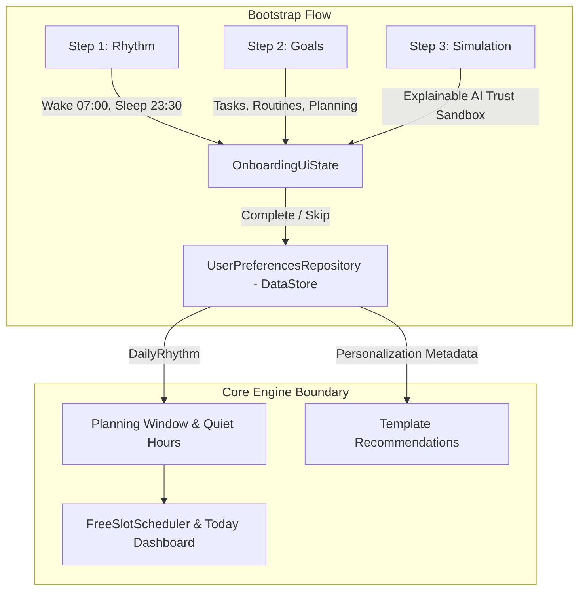

# Cue (SmartReminder) — Onboarding to Core Architecture Contract

> **Tài liệu Handoff Kiến trúc Chính thức:** Định nghĩa ranh giới phân tách (Boundary), hợp đồng dữ liệu (Data Contract) và các bất biến kiến trúc (Architectural Invariants) chuyển giao từ tầng Bootstrap/Onboarding sang tầng Core Engine (ScheduleGroup, Schedule/Routine, Task, ReminderRule, FreeSlotScheduler).

---

## 1. 🎯 Mục Đích của Tầng Bootstrap / Onboarding

Onboarding trong Cue không phải là các slide giới thiệu tính năng, mà là **bước thu thập tham số cấu hình đầu vào toàn cục (Global Boundary Constraints)** cho toàn bộ hệ thống lập lịch thông minh:



### Ý nghĩa từng bước Onboarding:
* **Step 1: Rhythm (`wakeUpTime`, `sleepTime`)**: Xác định `Planning Window` (khoảng thời gian thức cho phép tìm Free Slots để xếp task) và `Quiet Hours` (khoảng thời gian nghỉ ngơi cần bảo vệ giấc ngủ).
* **Step 2: Goals (`selectedGoals: Set<UserGoal>`)**: Metadata cá nhân hóa dùng để xếp thứ tự ưu tiên gợi ý và gợi ý templates lần đầu. **Không phải thực thể Room**.
* **Step 3: Timeline Simulation**: **Interactive Mental Model & Trust-Building Sandbox** (Mô phỏng mẫu giúp người dùng hiểu cơ chế Explainable AI trước khi vào app thật).

---

## 2. ⚡ Kiến Trúc Luồng Trạng Thái Reactive (Đã Đóng Băng)

Navigation trong Cue là **Derived State (Trạng thái suy diễn)** dựa trên DataStore Flow, **không dùng Navigation Side Effects / Events**:

```text
OnboardingAction.Complete / Skip
        ↓
OnboardingViewModel.completeOnboarding()
        ↓
UserPreferencesRepository.completeOnboarding()
        ↓ (1 atomic dataStore.edit {})
DataStore<Preferences>
        ↓
Flow<UserPreferences>
        ↓
AppViewModel.appState (StateFlow)
        ↓
AppState.Main
        ↓
MainActivity Crossfade → SmartReminderApp()
```

### Invariants:
* **Không tồn tại `OnboardingEvent.Completed`**: Xóa bỏ hoàn toàn event callback. `OnboardingRoute` là stateless bridge:
  ```kotlin
  OnboardingRoute(viewModel = onboardingViewModel)
  ```
* **Stateless Screen**: `OnboardingScreen` chỉ nhận `uiState` và phát `onAction`, khóa vuốt tay pager (`userScrollEnabled = false`) để ViewModel làm Single Source of Truth.

---

## 3. 🧭 Phân Định Trách Nhiệm `AppViewModel` (Root Orchestrator)

`AppViewModel` là bộ điều phối gốc ở mức ứng dụng, **không phải God ViewModel**:

| Được phép làm (`✓`) | Tuyệt đối cấm (`✗`) |
|---|---|
| Xác định trạng thái gốc `appState` (`Loading`, `Onboarding`, `Main`) | Không render hay chứa logic UI |
| Cung cấp `themeMode` (`SYSTEM`, `LIGHT`, `DARK`) | Không phụ thuộc trực tiếp vào DataStore implementation |
| Hoàn tất onboarding khi đăng nhập thành công (`completeOnboardingForAuthenticatedUser()`) | Không chứa business logic của Schedule, Routine, Task |
| Reset onboarding (`resetOnboarding()`) | Không gọi trực tiếp Room DAOs |
| Bảo toàn preferences cũ khi authenticate | |
| Bắt lỗi `IOException` từ các thao tác ghi gốc | |

---

## 4. 🗂️ Phân Tầng Trạng Thái: `AppState` vs `OnboardingFlowStage`

Ứng dụng phân định rạch ròi 2 máy trạng thái độc lập:

```text
AppState (Toàn cục - AppViewModel)
├── Loading    (Tránh flicker/flash khi khởi động cold-start)
├── Onboarding (User chưa hoàn thành cấu hình khởi tạo)
│     │
│     └── OnboardingFlowStage (Cục bộ - MainActivity / WelcomeFlow)
│           ├── WELCOME          (Đăng nhập Google / Tiếp tục với Email)
│           └── ONBOARDING_STEPS (3 bước cấu hình Rhythm, Goals, Simulation)
│
└── Main       (User đã có cấu hình hợp lệ → SmartReminderApp)
```

* **`AppState`** trả lời câu hỏi: *"Người dùng đã hoàn tất khởi tạo ứng dụng hay chưa?"*
* **`OnboardingFlowStage`** trả lời: *"Người dùng đang ở bước nào trong tiến trình giới thiệu/đăng nhập?"*

---

## 5. 🔒 Quy Tắc Vòng Đời Xác Thực (Auth One-Shot State Invariant)

Trạng thái thành công của Auth là **Transient Event (Tạm thời)**, bắt buộc phải được consume:

```text
AuthUiState.Success
        ↓
WelcomeScreen (LaunchedEffect)
        ↓
Toast thông báo & onLoginSuccess()
        ↓
onAction(AuthUiAction.Reset) → AuthUiState.Idle
```

> **Invariant:** `AuthUiState.Success` bắt buộc phải trở về `AuthUiState.Idle` ngay sau khi xử lý. Không bao giờ lưu giữ `Success` lâu dài trong ViewModel để tránh lỗi tự động nhảy vào Main khi người dùng thực hiện `Reset Onboarding`.

---

## 6. 🏛️ Ranh Giới Bất Biến: DataStore vs Room Database

Đây là ranh giới kiến trúc cốt lõi **bắt buộc tuân thủ 100%** trong toàn bộ quá trình phát triển:

```text
                  PREFERENCES
                ┌──────────────┐
                │  DataStore   │  (Jetpack DataStore Preferences)
                └──────┬───────┘
                       │
                UserPreferences (Domain Model)
                       │
          ┌────────────┼────────────┐
          │            │            │
       wakeTime     sleepTime     goals
          │            │            │
          └────────────┼────────────┘
                       ↓
               CORE DOMAIN INPUT


                  CORE DATA
                ┌──────────────┐
                │     Room     │  (SQLite / Room Database)
                └──────┬───────┘
                       │
          ┌────────────┼──────────────┐
          ↓            ↓              ↓
    ScheduleGroup     Task      ReminderRule
```

### Phân công trách nhiệm lưu trữ:
* **Jetpack DataStore Preferences**:
  - `wakeUpTime: LocalTime` (lưu dạng `minutes-of-day: Int`)
  - `sleepTime: LocalTime` (lưu dạng `minutes-of-day: Int`)
  - `goals: Set<UserGoal>` (lưu dạng `Set<String>` storageKey)
  - `themeMode: ThemeMode` (lưu dạng `String` storageKey)
  - `onboardingCompleted: Boolean`
* **Room Database**:
  - `ScheduleGroup` (Nhóm lịch trình: Work, Study, Personal Routine)
  - `Schedule` / `Routine` (Lịch cố định, thói quen lặp lại)
  - `Task` (Công việc, deadline, sub-tasks)
  - `ReminderRule` (Quy tắc nhắc nhở, khoảng cách báo trước)
  - `ExecutionHistory` (Lịch sử hoàn thành, nhật ký thực thi)
  - `ScheduleOverrides` (Ngoại lệ ngày nghỉ, đổi giờ đột xuất)

---

## 7. 🚫 Không Nhân Bản (Duplicate) wake/sleep sang Room

* **Cấm:** Không tạo các bảng như `CoreSettingsEntity` hay lưu `wakeUpTime`/`sleepTime` lặp lại trong Room.
* **Chuẩn:** Core Engine nhận dữ liệu thông qua Domain Abstraction:
  ```kotlin
  data class DailyRhythm(
      val wakeUpTime: LocalTime,
      val sleepTime: LocalTime
  )
  ```
  `FreeSlotScheduler` nhận `DailyRhythm` từ `UserPreferencesRepository`, **không cần biết và không được biết dữ liệu đó đến từ DataStore**.

---

## 8. 🏷️ `UserGoal` KHÔNG Phải Thực Thể Core

* `UserGoal` (`TASKS`, `ROUTINES`, `PLANNING`, `STUDY`, `TEAMWORK`) chỉ là **Personalization Metadata (Dữ liệu định hướng cá nhân hóa)**.
* **Cấm:**
  - Không tạo Foreign Key từ `Task` hoặc `ScheduleGroup` trỏ tới `UserGoal`.
  - Không bắt buộc `ScheduleGroup` phải có trường `UserGoal`.
* **Ứng dụng hợp lệ:** Dùng `goals` để xếp thứ tự các **Template Recommendations** khi người dùng tạo mới Schedule/Routine.

---

## 9. 🛡️ Không Tự Ý Tạo Dữ Liệu Lịch Trình Khi Onboarding Complete

* Khi người dùng hoàn thành Onboarding, ứng dụng **KHÔNG tự động tạo bất kỳ `ScheduleGroup` hay `Task` nào vào Room**.
* **Luồng chuẩn:**
  ```text
  Complete Onboarding
          ↓
     AppState.Main
          ↓
  HomeScreen hiển thị:
  "Tạo lịch trình đầu tiên của bạn" + Gợi ý Templates theo UserGoal
          ↓
  Người dùng chủ động xác nhận → Mới lưu vào Room
  ```
* **Decoupling Invariant:** `OnboardingViewModel` có **ZERO dependencies** đối với `ScheduleRepository` hay Room Database.

---

## 10. 📐 Sơ Đồ Phụ Thuộc Toàn Ứng Dụng (Target Architecture)

```text
                        UI LAYER
                           │
         ┌─────────────────┼──────────────────┐
         │                 │                  │
   AppViewModel      OnboardingVM       Core ViewModels
         │                 │            (Home, Schedule, Task)
         │                 │                  │
         │                 │                  ↓
         │                 │            Core Use Cases
         │                 │        (CalculateFreeSlots, ...)
         │                 │                  │
         └────────┬────────┘                  ↓
                  │                     Core Repositories
                  ↓                 (ScheduleRepo, TaskRepo)
      UserPreferencesRepository               ▲
             «interface»                      │
                  ▲                     Room Database
                  │
  DataStoreUserPreferencesRepo
                  │
              DataStore
```

### Quy tắc bất biến về truy xuất chéo:
- `FreeSlotScheduler` $\rightarrow$ Đọc `DailyRhythm` qua `UserPreferencesRepository`.
- `FreeSlotScheduler` $\boldsymbol{\times}$ **Không bao giờ** import DataStore.
- `TaskRepository` / `ScheduleRepository` $\boldsymbol{\times}$ **Không bao giờ** import DataStore.
- `OnboardingViewModel` $\boldsymbol{\times}$ **Không bao giờ** import Room Database.

---

## 📋 11. Hợp Đồng Bàn Giao (Onboarding Output Contract)

Sau khi Onboarding hoàn tất và chuyển sang `AppState.Main`, Core Engine được phép **giả định (assume)** các điều kiện sau:

| # | Invariant được đảm bảo | Ghi chú |
|---|---|---|
| **1** | `UserPreferences` luôn khả dụng | Luôn có dữ liệu (kể cả khi chạy offline). |
| **2** | `wakeUpTime` luôn là `LocalTime` hợp lệ | Mapper đảm bảo fallback an toàn về `07:00` nếu lỗi. |
| **3** | `sleepTime` luôn là `LocalTime` hợp lệ | Mapper đảm bảo fallback an toàn về `23:30` nếu lỗi. |
| **4** | `goals` có thể rỗng (`emptySet()`) | Core phải hoạt động hoàn hảo ngay cả khi user bỏ chọn hết goals. |
| **5** | `onboardingCompleted = true` | Đảm bảo không bị văng lại màn hình Onboarding. |
| **6** | `themeMode` luôn có giá trị hợp lệ | Mặc định `ThemeMode.SYSTEM`. |
| **7** | **Không có `ScheduleGroup` nào được đảm bảo tồn tại sẵn** | Core phải xử lý trạng thái Empty State hoàn hảo. |
| **8** | **Không có `Task` nào được đảm bảo tồn tại sẵn** | Core phải hiển thị CTA tạo task đầu tiên. |
| **9** | **Không có `ReminderRule` nào được đảm bảo tồn tại sẵn** | Dùng default reminder rules khi tạo task mới. |
| **10** | **Toàn bộ hệ thống hoạt động 100% Offline** | Không phụ thuộc mạng Internet cho các tính năng cốt lõi. |

---

> 📌 **Kết luận:** Tài liệu này đóng vai trò là **Hợp đồng Kiến trúc bất biến (Frozen Contract)**. Khi triển khai module `ScheduleGroup`, toàn bộ thiết kế sẽ tuân thủ nghiêm ngặt các ranh giới và giả định đã quy định ở trên.
