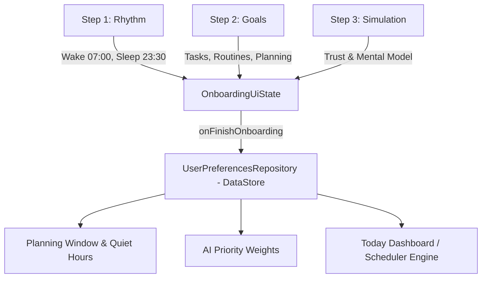

# Cue (SmartReminder) — Onboarding & Core Architecture Roadmap

> **Tài liệu bàn giao kiến trúc:** Giải thích chi tiết toàn bộ luồng dữ liệu Onboarding, mục đích thực sự của từng màn hình, cách lưu trữ dữ liệu để tích hợp với Core Business Logic sau này, và lộ trình phát triển các màn hình tiếp theo.

---

## 1. 🎯 Tổng quan Luồng Onboarding & Mục đích Sản phẩm

Onboarding trong Cue không phải là "vài trang giới thiệu tĩnh (intro slides)", mà là **bước thu thập tham số cấu hình đầu vào bắt buộc** cho toàn bộ **AI Scheduling & Reminder Engine**.



---

## 2. 🧩 Chi tiết Dữ liệu từng Step & Ứng dụng Thực tế

### ☀️ Step 1: Rhythm (Wake up & Sleep Times)
* **Dữ liệu thu thập:**
  - `wakeUpTime: LocalTime` (Mặc định: `07:00`)
  - `sleepTime: LocalTime` (Mặc định: `23:30`)
* **Hệ quả tính toán (Domain Logic):**
  - `Planning Window` = Khoảng thời gian thức (VD: `16h 30m`). Đây là vùng Cue được phép tìm Free Slots để xếp việc.
  - `Quiet Hours` = Khung giờ nghỉ ngơi (VD: `7h 30m`). Vùng Cue bảo vệ giấc ngủ của người dùng.
* **Tích hợp sau này:**
  1. **Schedule Engine:** Thuật toán xếp lịch tự động sẽ chặn không bao giờ gợi ý task ngoài Planning Window (trừ khi người dùng chủ động ép buộc).
  2. **Notification & Quiet Hours Engine:** Cấu hình thông báo sẽ mặc định tắt chuông/nhắc nhở không khẩn cấp trong Quiet Hours (kết nối với cài đặt trong `SettingsScreen`).

---

### 🎯 Step 2: Goals (Mục tiêu Cá nhân hóa)
* **Dữ liệu thu thập:**
  - `selectedGoals: Set<OnboardingGoal>`:
    - `TASKS`: Quản lý công việc, deadline, nhắc nhở quan trọng.
    - `ROUTINES`: Xây dựng thói quen lặp lại hàng ngày/hàng tuần.
    - `PLANNING`: Tối ưu hóa thời gian, AI tìm khoảng trống (Free Slots).
    - `STUDY`: Học tập trung, Pomodoro, phiên học chuyên sâu.
    - `TEAMWORK`: Phối hợp nhóm, lịch chung.
* **Tích hợp sau này:**
  1. **AI Weight Vector:** Nếu người dùng chọn `PLANNING` + `STUDY`, thuật toán ưu tiên tạo các khối thời gian tập trung 90–120 phút. Nếu chọn `TASKS`, ưu tiên nhắc nhở deadline và checklist.
  2. **Home Widgets:** Quyết định card/section nào sẽ xuất hiện đầu tiên trên màn hình chính (Today Dashboard).
  3. **Initial Templates:** Gợi ý các template task/routine phù hợp ngay trong lần đầu tạo việc.

---

### 🧠 Step 3: Timeline Simulation (Mục tiêu cốt lõi là gì?)
> **Câu hỏi:** *"Mục tiêu ở trang step 3 là để làm gì?"*

* **Mục đích:** Step 3 **KHÔNG PHẢI** để người dùng nhập lịch của họ, mà là **Interactive Mental Model & Trust-Building Sandbox** (Mô phỏng tương tác giúp xây dựng niềm tin vào nguyên lý làm việc của Cue).
* **Vấn đề tâm lý người dùng:** Đa số người dùng hoài nghi: *"AI nói thông minh nhưng nó sẽ xếp lịch cho tôi như thế nào?"*.
* **Giải pháp của Step 3:**
  1. Cho người dùng thấy một kịch bản ngày làm việc mẫu:
     - 09:00: Giờ học trên lớp (`Class`)
     - 13:30: Họp dự án nhóm (`Project meeting`)
     - 17:00: Tập thể thao (`Workout`)
  2. **Khoảng trống tự nhiên (Free Slot):** Giữa 13:30 và 17:00 có một khoảng trống 2 tiếng.
  3. **Đề xuất của Cue:** Cue tự động đề xuất: *"Bắt đầu làm bài tập · 15:00"*.
  4. **Minh bạch AI (Explainable AI):** Khi người dùng chạm vào đề xuất, một tooltip xuất hiện giải thích lý do: *"Tại sao lại là 15:00? Phát hiện khoảng trống 2 tiếng giữa cuộc họp và giờ tập thể thao"*.
* **Thông điệp cốt lõi:** *"Cue suggests. You stay in control."* (Cue gợi ý, bạn nắm quyền quyết định).
* **Kết quả:** Người dùng hiểu 100% cách app vận hành trước khi bấm CTA *"Start using Cue"* để vào màn hình chính.

---

## 3. 💾 Thiết kế Lưu Trữ Dữ Liệu (Data Persistence Architecture)

Dữ liệu Onboarding được lưu thông qua **Jetpack DataStore Preferences** để toàn bộ ứng dụng có thể quan sát dạng `Flow`:

```kotlin
// Data Model lưu trữ
data class UserPreferences(
    val wakeUpTime: LocalTime,
    val sleepTime: LocalTime,
    val selectedGoals: Set<OnboardingGoal>,
    val hasCompletedOnboarding: Boolean
)
```

### Flow chuyển tiếp từ Onboarding sang Main App:
1. Người dùng bấm **"Start using Cue"** ở Step 3 (hoặc bấm **"Skip"** ở bất kỳ step nào).
2. `OnboardingViewModel.completeOnboarding()` được gọi:
   ```kotlin
   fun completeOnboarding() {
       viewModelScope.launch {
           userPreferencesRepository.saveOnboardingData(
               wakeTime = _uiState.value.wakeUpTime,
               sleepTime = _uiState.value.sleepTime,
               goals = _uiState.value.selectedGoals
           )
           userPreferencesRepository.setOnboardingCompleted(true)
           _events.emit(OnboardingEvent.NavigateToHome)
       }
   }
   ```
3. `MainActivity` quan sát `hasCompletedOnboarding`:
   - Nếu `false` $\rightarrow$ Render `OnboardingScreen`.
   - Nếu `true` $\rightarrow$ Render `HomeScreen` (Main App).

---

## 4. 🗺️ Lộ trình Phát triển Các Màn hình Tiếp theo (Next Phase Roadmap)

Sau khi hoàn tất Onboarding, ứng dụng sẽ triển khai các module sau:

```text
app/src/main/java/com/smartreminder/
├── data/
│   ├── local/
│   │   ├── database/ (Room Database: TaskEntity, RoutineEntity, ScheduleEventEntity)
│   │   └── preferences/ (DataStore: UserPreferencesRepository)
│   └── repository/ (TaskRepositoryImpl, RoutineRepositoryImpl)
├── domain/
│   ├── model/ (Task, Routine, FreeSlot, Priority)
│   ├── time/ (TimeCalculator, FreeSlotCalculator)
│   ├── scheduler/ (ScheduleEngine, ConflictDetector)
│   └── reminder/ (ReminderEngine, QuietHoursRule)
└── ui/
    ├── home/ (Today Dashboard: Timeline 24h, AI Suggestion Card, Task List)
    ├── task/ (TaskDetail, CreateTaskBottomSheet)
    ├── routines/ (RoutineList, CreateRoutineScreen)
    └── settings/ (QuietHoursSetting, RhythmSetting, NotificationPreferences)
```

### Các tính năng cốt lõi sẽ kết nối trực tiếp với Onboarding:

1. **Màn hình chính (`HomeScreen` / `TodayTimelineScreen`):**
   - Đọc `wakeUpTime` và `sleepTime` để vẽ thanh **Today 24-Hour Timeline Bar** ở đầu trang.
   - Hiển thị các block sự kiện trong ngày và các khoảng trống **Free Slots**.
   - Nếu có Free Slot $\rightarrow$ Hiển thị **AI Suggestion Card** đề xuất task phù hợp nhất dựa trên `selectedGoals`.

2. **Công cụ xếp lịch thông minh (`FreeSlotCalculator` & `ConflictDetector`):**
   - `FreeSlotCalculator`: `Planning Window − Lịch cố định − Buffer = Free Slots`.
   - Kiểm tra xung đột: Khi tạo task mới, cảnh báo nếu trùng giờ hoặc sát Quiet Hours.

3. **Cài đặt & Tùy chỉnh (`SettingsScreen`):**
   - Cho phép người dùng xem lại và chỉnh sửa lại giờ Thức/Ngủ (`Rhythm`) và Mục tiêu (`Goals`) bất kỳ lúc nào.
   - Cài đặt chi tiết cho Quiet Hours:
     - `○ Không bao giờ nhắc nhở`
     - `● Chỉ nhắc deadline khẩn cấp`
     - `○ Cho phép mọi nhắc nhở`

---

## 5. 🛠️ Quy chuẩn Kiểm thử & Code Clean (Bảo lưu cho Bước tiếp theo)

* **Toàn bộ Domain Engines** (`FreeSlotCalculator`, `ConflictDetector`, `RepeatRule`, `ReminderEngine`) bắt buộc viết Unit Test theo mẫu **AAA / Given-When-Then** trước khi tích hợp UI.
* **100% Design Tokens**: Màu sắc qua `Color.kt`, Khoảng cách qua `CueSpacing`, Font qua `MaterialTheme.typography`.
* **100% Song ngữ**: Mọi text mới phải khai báo đồng thời ở `values/strings.xml` và `values-vi/strings.xml`.
